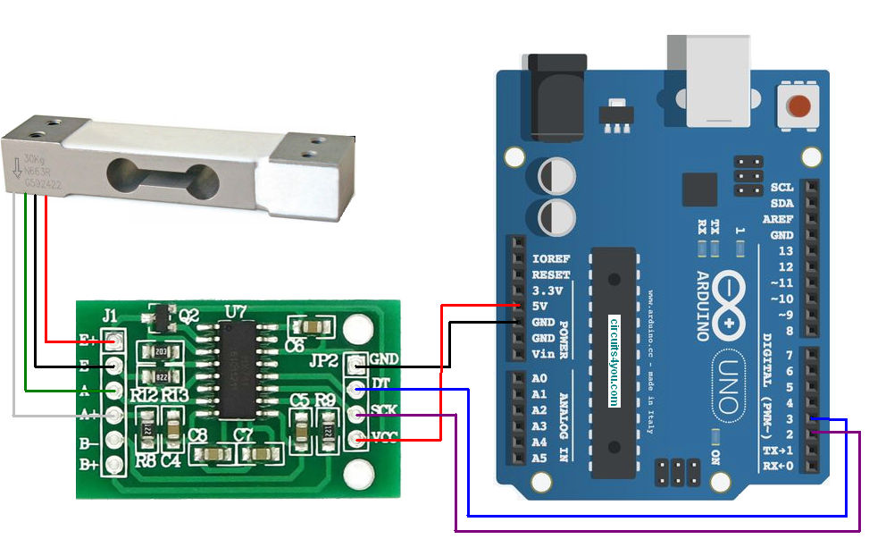

# loadcell_ros

## Communicating with rosserial using arduino to use load cell
   
# Test Env.

* jetson AGX xavier (jetpack 4.5.1, ubuntu 18.04, ROS melodic)
* Aruduino Uno (HX711, load cell)   
  - Connect Arduino to jetson via USB

# Load Cell

* The basics of the load cell are detailed in the link below.  
<https://jstar0525.tistory.com/150>

### Circuit Connection diagram

</img>

* HX711 libraries is in libraries folder

# rosserial

* if you didn't install rosserial, you can see page below

<https://jstar0525.tistory.com/150>

# RUN

1. Open loadcell_ros.ino in Arduino IDE
2. Set Tools-Board, Port  
   * you can check the port and give permission using the command below
```
$ ls /dev/ttyUSB*
$ sudo chmod 766 /dev/ttyUSB?
```
3. Upload loadcell_ros.ino
4. Run the command below for ROS
```
# 1st terminal
$ source /opt/ros/melodic/setup.bash
$ roscore
```
```
# 2nd terminal
$ source /opt/ros/melodic/setup.bash
$ rosrun rosserial_python serial.node.py _port:=/dev/ttyUSB? _baud:==57600
```
```
# 3rd terminal
$ source /opt/ros/melodic/setup.bash
$ rostopic list
$ rostopic echo gram
```